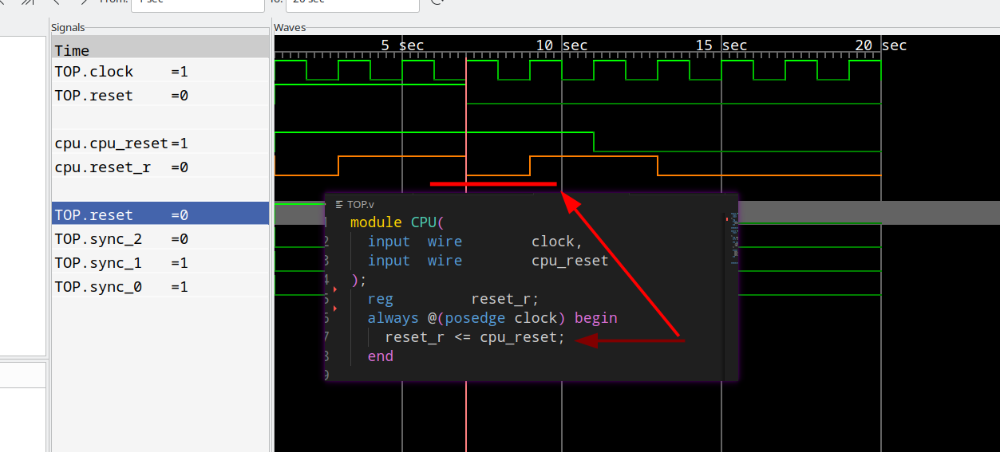

 
## Bug in Verilator that leads to a wrong runtime value (and infinite recursion)

### Usage
* Have Verilator and GtkWave installed
* Run `make all` it will verilate the model and open the wave log for you

### Bug 1 -- incorrect runtime value
#### Verilator

* `cpu.reset_r` should be 1 at cycle 4 instead of 0

#### Icarus result

### Bug 2 -- Infinite recursion

Run `ARGS=-O0 make bin` and notice the `VTOP___024root__trace_init_sub__TOP__0` function in `VTOP__Trace__0__Slow.cpp`. ARGS is passed to Veriloator directly.

Seems it will call itself unconditionally.

### Tested version
Verilator 5.023 devel rev v5.020-121-ga69cb9b0

Verilator 5.022 2024-02-24 rev v5.020-157-g2b485204
